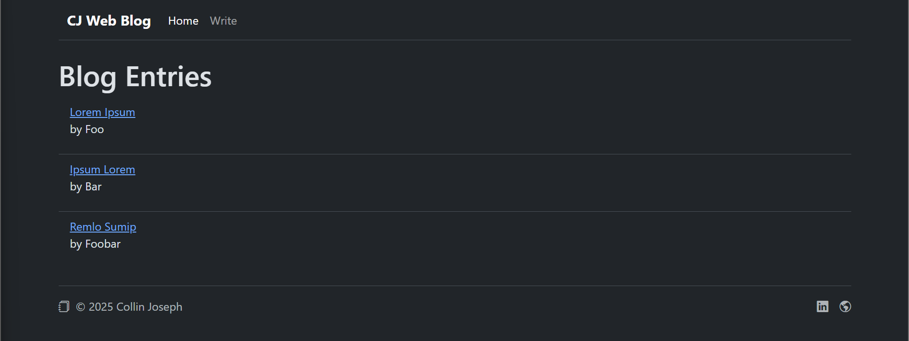
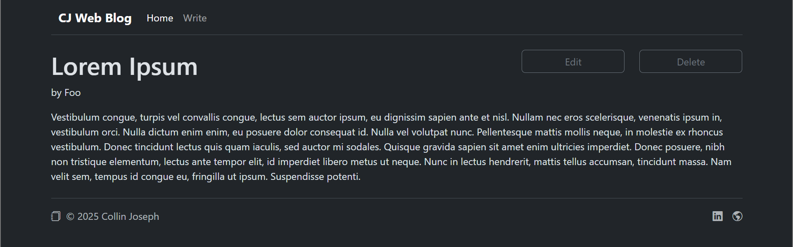
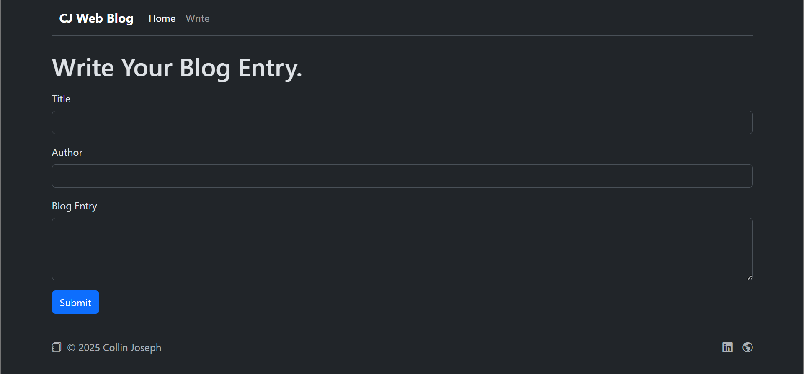
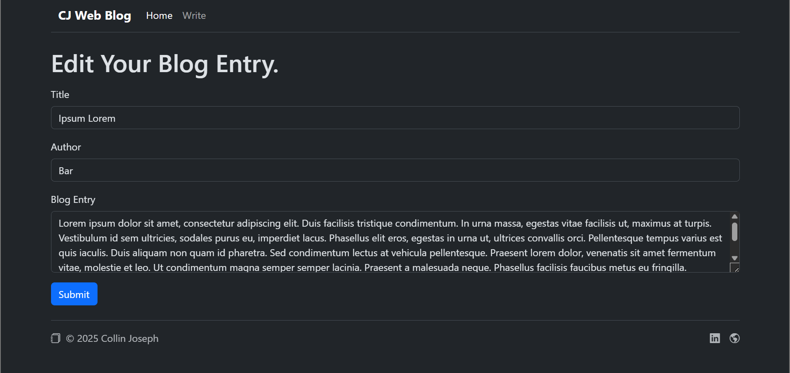

# CJ Web Blog

**Stack**: `HTML, EJS, CSS, Bootstrap, jQuery, Node.js, Express.js` 
**Description**: A blog hosting website. Users can: **view**, **create**, **edit** and **delete** blog entries.

## Screenshots

<b>Figure 1.</b> <i>Blog Homepage</i>

 

<b>Figure 2.</b> <i>Read/View Page</i>

 

<b>Figure 3.</b> <i>Write/Create Page</i>

 

<b>Figure 4.</b> <i>Edit Page</i>

Collin Joseph, 2025
